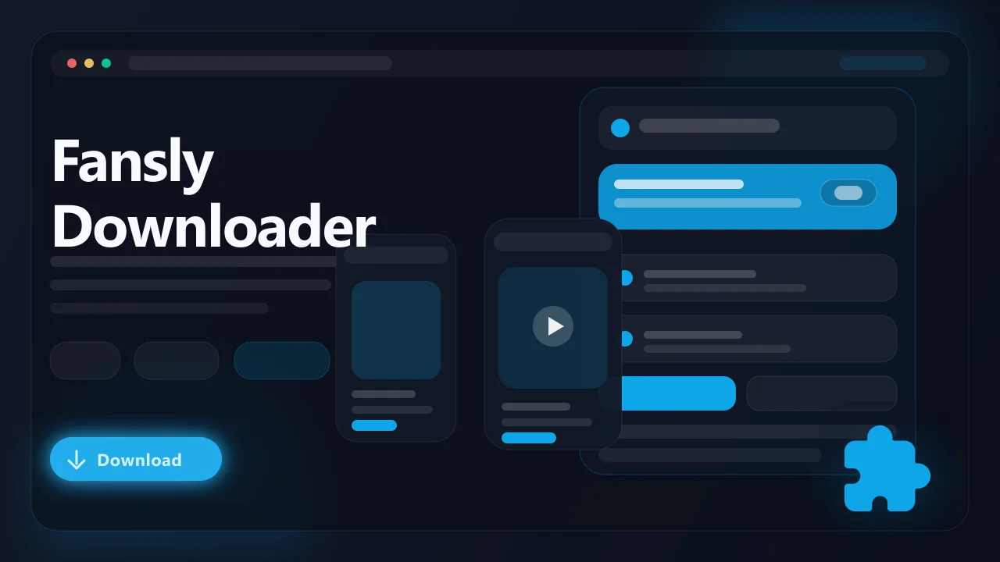

# Fansly Video Downloader (Browser Extension)

> Download videos, images, GIFs, text posts, and creator-page media from Fansly pages you can already access.

Fansly Downloader is a browser extension built for subscribers who want a cleaner way to save accessible Fansly media for offline viewing, local backup, and personal organization. It works inside your active Fansly browser session, detects supported media on creator pages and posts, and provides a browser-native download workflow without requiring desktop tools or command-line utilities.

- Save supported Fansly videos as MP4 files
- Download images, GIFs, and visible post media
- Capture text posts for personal archiving and reference
- Use bulk tools to collect media from a creator page
- Works across Chrome, Edge, Brave, Opera, Yandex, and Whale

## Links

- :rocket: Get it here: [Fansly Downloader](https://serp.ly/fansly-downloader?via=github)
- :new: Latest release: [GitHub Releases](https://github.com/serpapps/fansly-downloader/releases/latest)
- :question: Help center: [SERP Help](https://help.serp.co/en/)
- :beetle: Report bugs: [GitHub Issues](https://github.com/serpapps/fansly-downloader/issues)
- :bulb: Request features: [Feature Requests](https://github.com/serpapps/fansly-downloader/issues)

## Preview

## Table of Contents

- [Why Fansly Downloader](#why-fansly-downloader)
- [Features](#features)
- [How It Works](#how-it-works)
- [Step-by-Step Tutorial: How to Download Fansly Content](#step-by-step-tutorial-how-to-download-fansly-content)
- [Supported Formats](#supported-formats)
- [Who It's For](#who-its-for)
- [Common Use Cases](#common-use-cases)
- [Troubleshooting](#troubleshooting)
- [Trial & Access](#trial--access)
- [Installation Instructions](#installation-instructions)
- [FAQ](#faq)
- [Notes](#notes)
- [License](#license)
- [About Fansly](#about-fansly)

## Why Fansly Downloader

Fansly delivers subscription content through a web-based feed. Videos, images, GIFs, and text posts are easy to view in the browser, but saving accessible media into an organized local library can be slow and repetitive. Users often end up relying on screen recordings, manual page inspection, or one-off downloads that do not preserve much context.

Fansly Downloader focuses on the active browser page. It detects supported media available to your logged-in session, organizes the results by type, and lets you save individual items or queue creator-page media through the extension sidebar.

## Features

- Video detection for supported Fansly creator pages and posts
- Image and GIF download support for accessible post media
- Text post capture for local notes and personal archives
- Bulk creator-page collection for videos, images, GIFs, and text posts
- Sidebar interface with separate video, image, text, and bulk views
- Browser-native downloads through the normal downloads system
- Progress tracking through the in-extension download manager
- Shared SERP authentication and free trial flow
- Cross-browser packaging for Chrome, Edge, Brave, Opera, Yandex, and Whale

## How It Works

1. Install the extension from the latest release.
2. Open Fansly and sign in to the account with access to the creator content.
3. Navigate to a creator page or post containing media you want to save.
4. Open the Fansly Downloader extension sidebar.
5. Review the detected videos, images, GIFs, text posts, or bulk tools.
6. Download individual items or collect creator-page media in bulk.
7. Files are saved through your browser's normal downloads system.

## Step-by-Step Tutorial: How to Download Fansly Content

1. Install Fansly Downloader from the latest GitHub release.
2. Sign in to Fansly in the same browser profile.
3. Open the creator page or post you want to save from.
4. Let the page load fully. For videos, play or reveal the post if needed so the browser can initialize media.
5. Click the Fansly Downloader extension button.
6. Use the sidebar tabs to review videos, images, text posts, or bulk tools.
7. Click Download for an individual item, or use Bulk Tools to collect creator-page media.
8. Wait for the queue to finish and find the saved files in your browser's Downloads folder.

## Supported Formats

- Input: Supported Fansly CDN video files
- Input: Supported Fansly-hosted images and GIFs
- Input: Visible Fansly post text
- Output: MP4 for supported video downloads
- Output: Original source image or GIF formats where available
- Output: TXT for saved text posts

Available formats and quality depend on what Fansly exposes to your browser session for the current page and account.

## Who It's For

- Fansly subscribers who want offline access to content from creators they support
- Users organizing paid subscription media in local folders
- Content archivists keeping personal backups of accessible posts
- People with limited or unreliable internet access who prefer local playback
- Subscribers managing content across multiple creator pages

## Common Use Cases

- Save a creator's video post for offline viewing
- Archive image sets from a subscription before content rotates
- Keep text posts and captions for personal reference
- Queue multiple creator-page files during one session
- Build a local media library organized by creator and post

## Troubleshooting

**The extension does not detect a video**  
Open the post, let the page load fully, and try playing the video briefly before scanning again.

**The sidebar says no media was found**  
Refresh the Fansly page, scroll enough for the posts to load, then reopen the extension sidebar.

**Bulk collection finds fewer items than expected**  
Fansly loads feeds dynamically. Scroll the creator page to load more posts, then run bulk collection again.

**A download is blocked by access or login state**  
The extension only works with content your Fansly account can already access in the current browser session.

**A file name looks generic**  
Some posts expose limited metadata. The extension uses the best available creator, post, and media details for filenames.

## Trial & Access

- Includes **3 free downloads** so you can test the workflow first
- Email sign-in uses secure one-time password verification
- No credit card required for the trial
- Unlimited downloads are available with a paid license

Start here: [https://serp.ly/fansly-downloader?via=github](https://serp.ly/fansly-downloader?via=github)

## Installation Instructions

1. Open the latest release page:
   [https://github.com/serpapps/fansly-downloader/releases/latest](https://github.com/serpapps/fansly-downloader/releases/latest)
2. Download the extension build for your browser.
3. Install or load the extension in your browser.
4. Open Fansly and sign in.
5. Navigate to a supported creator page or post.
6. Use the extension sidebar to detect and download available content.

## FAQ

**What kinds of Fansly content can I download?**  
Supported videos, images, GIFs, and text posts that are available to your logged-in Fansly session.

**Does it work on paid posts?**  
It works only when your Fansly account already has access to the post in the browser.

**Can it download an entire creator page?**  
The bulk tools collect media from creator pages that your browser can load and access. Dynamic feeds may require scrolling to load more posts first.

**Do I need extra software?**  
No. The workflow runs through the browser extension and browser downloads system.

**Where are files saved?**  
Files are saved through your browser's normal download flow, usually into your Downloads folder.

## Notes

- Only download content you own or have explicit permission to save
- The extension only works on media you can already access in your browser session
- Media quality depends on the source content Fansly exposes for that post
- Fansly platform updates may affect detection and download behavior
- An internet connection is required to access and download media from the site

## License

This repository is distributed under the proprietary SERP Apps license in the [LICENSE](LICENSE) file. Review that file before copying, modifying, or redistributing any part of this project.

## About Fansly

Fansly is a subscription-based creator platform where creators publish exclusive photos, videos, GIFs, and posts for followers and paying subscribers. Fansly Downloader provides a focused browser-extension workflow for saving supported content locally when you have the right to download it.
